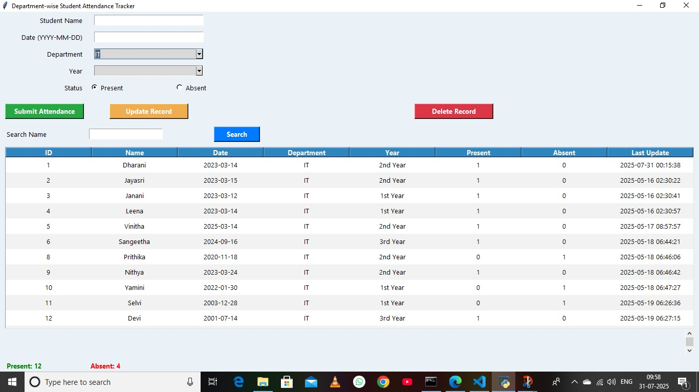

# Student Attendance Monitor

## 📌 Project Description

Student Attendance Monitor is a Python-based application developed to manage and monitor student attendance records. It helps reduce manual attendance work and makes it easier to store, update, and view attendance information.

## 🛠️ Technologies Used

- Python
- Tkinter
- SQLite
- Regular Expressions (Regex)

## ✨ Features

- Add student details
- Mark students as Present or Absent
- View attendance records
- Update student information
- Delete student records
- Search student records
- Track present and absent counts
- Store attendance data using SQLite

## 💡 What I Learned

Through this project, I improved my understanding of:

- Python programming
- Tkinter GUI development
- SQLite database operations
- CRUD operations
- Database connectivity
- Problem-solving and debugging

## 🚀 Future Improvements

- Improve the user interface
- Add login functionality
- Add attendance reports
- Add date-wise and department-wise reports
- Develop a web-based version

## 📸 Screenshots

### Attendance Dashboard

## 👩‍💻 Developed By

**Dharani K**  
B.Sc Computer Science Graduate
